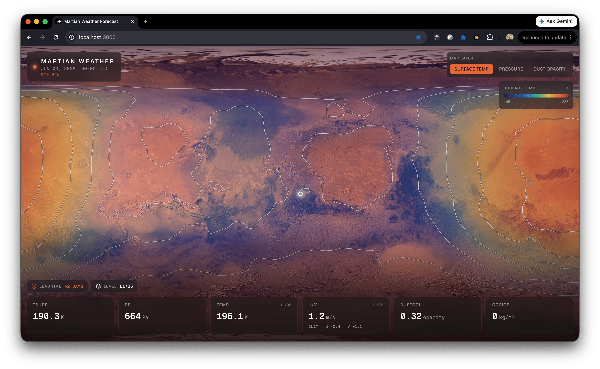
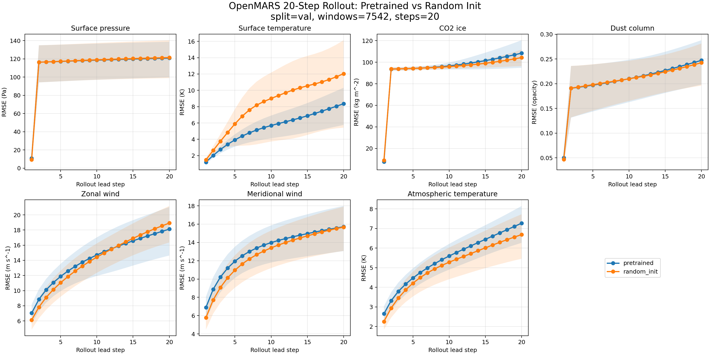

# Mars Weather Transfer Learning

Can an Earth weather foundation model help forecast weather on Mars?

This hackathon project adapts [Aurora](https://github.com/microsoft/aurora), a pretrained atmospheric model, to OpenMARS reanalysis data. The goal was to test whether Earth-weather pretraining transfers to a low-data planetary forecasting setting after fine-tuning on Mars observations.



## What We Built

The repository contains two pieces:

- `mars_weather/`: PyTorch data adapters, training utilities, and model construction for fine-tuning Aurora on OpenMARS.
- `mars_weather_app/`: a Next.js dashboard for exploring exported Martian weather forecasts on a global Mars map.

The model predicts global weather fields every 2 Martian hours on the OpenMARS latitude-longitude grid. Surface fields are predicted over `(lat, lon)`, and atmospheric fields are predicted over `(sigma level, lat, lon)`.

| Field | Meaning | Units | Dimensions |
| --- | --- | --- | --- |
| `ps` | Surface pressure | Pa | `lat, lon` |
| `tsurf` | Surface temperature | K | `lat, lon` |
| `co2ice` | Surface CO2 ice mass | kg/m2 | `lat, lon` |
| `dustcol` | Dust column opacity | opacity | `lat, lon` |
| `u` | Zonal wind | m/s | `lev, lat, lon` |
| `v` | Meridional wind | m/s | `lev, lat, lon` |
| `temp` | Atmospheric temperature | K | `lev, lat, lon` |

The OpenMARS vertical coordinate uses 35 sigma levels from near-surface levels to the upper atmosphere.

## Experiment

Mars weather prediction is operationally important for landers, rovers, orbiters, entry-descent-landing planning, dust-storm risk, solar-power forecasting, and future crewed surface operations. The hard part is data scarcity: Earth weather models benefit from enormous observational and reanalysis archives, while Mars has a much smaller record.

We fine-tuned Aurora on OpenMARS Mars Years 28-34 and validated on Mars Year 35. Samples are split by the Mars Year of the target frame using `splits/openmars_my28-34_train_my35_val.json`.

We ran two main training configurations:

- **Pretrained:** Aurora initialized from Earth-weather pretraining, then adapted to Mars variables and sigma levels.
- **No pretraining:** the same Mars task setup, but without loading the pretrained Aurora checkpoint.

Both models were evaluated with 20-step autoregressive rollouts. At 2 Martian hours per step, this corresponds to a 40-Martian-hour forecast horizon. Evaluation reports normalized MSE plus physical RMSE and MAE for each forecast field.



## Result

Across the 20-step rollout, the pretrained and non-pretrained models performed similarly on most aggregate metrics. The clearest difference was surface temperature: the Earth-pretrained model reduced `tsurf` prediction error by about 30% compared with the non-pretrained model.

That result is preliminary because the hackathon timeline only allowed two main runs. Still, it is a useful signal: some of the structure learned from Earth weather appears to transfer to Mars after fine-tuning, even across different atmospheric composition, pressure regime, dust dynamics, radiative forcing, and planetary day length.

## Model Weights

Model-only weights are published on Hugging Face as `safetensors` exports. These uploads strip optimizer state and RNG state from the original training checkpoints, reducing each artifact from about 15 GB to about 4.7 GB.

| Model | Hugging Face repo | Notes |
| --- | --- | --- |
| Pretrained Aurora fine-tune | [`LucasAschenbach/mars-aurora-openmars-pretrained`](https://huggingface.co/LucasAschenbach/mars-aurora-openmars-pretrained) | Earth-pretrained Aurora base model fine-tuned on OpenMARS. |
| Random-init comparison | [`LucasAschenbach/mars-aurora-openmars-random-init`](https://huggingface.co/LucasAschenbach/mars-aurora-openmars-random-init) | Same Aurora architecture trained on OpenMARS without loading the Earth-pretrained checkpoint. |

Each model repository includes:

- `model.safetensors`: model-only PyTorch state dict.
- `openmars_stats.json`: normalization statistics needed to construct the Mars/OpenMARS model.
- `config.json`: export metadata, including source checkpoint step.
- `training_config.json` and `training_metadata.json`: run configuration and environment metadata.
- `rollout_eval_val_20step.json`: 20-step recursive rollout metrics on the MY35 validation split.

To reproduce the model-only export from a training checkpoint:

```bash
python scripts/export_hf_weights.py \
  --checkpoint artifacts/openmars_runs/<run>/checkpoint_step_9158.pt \
  --run-dir artifacts/openmars_runs/<run> \
  --output-dir artifacts/hf_exports/<model-repo-name> \
  --format safetensors \
  --model-name <model-repo-name>
```

Upload the resulting folder with:

```bash
hf upload-large-folder LucasAschenbach/<model-repo-name> \
  artifacts/hf_exports/<model-repo-name> \
  --repo-type model
```

## Repository Layout

```text
.
├── assets/                         # README graphics
├── mars_weather/                   # OpenMARS dataset, Aurora model, training utilities
├── mars_weather_app/               # Interactive forecast dashboard
├── scripts/
│   ├── create_openmars_split.py    # Build reproducible train/validation split manifests
│   ├── download_openmars.py        # Download OpenMARS NetCDF files from Figshare
│   ├── export_hf_weights.py        # Strip training state and export HF-ready weights
│   ├── export_rollout_netcdf.py    # Export recursive rollouts to NetCDF
│   ├── finetune_openmars.py        # Fine-tune Aurora on OpenMARS
│   ├── evaluate_openmars.py        # Recursive rollout evaluation
│   └── plot_rollout_eval.py        # Plot rollout metrics
├── splits/
│   └── openmars_my28-34_train_my35_val.json
└── tests/
```

## Setup

Clone the repository with submodules so the local Aurora dependency is available:

```bash
git clone --recurse-submodules https://github.com/LucasAschenbach/mars-weather
cd mars-weather
```

Install Python dependencies:

```bash
python -m venv .venv
source .venv/bin/activate
pip install -r requirements.txt
```

OpenMARS NetCDF files are expected under `data/`, matching the paths in the split manifest.
To download the files used by the included MY28-34/MY35 split:

```bash
python scripts/download_openmars.py \
  --manifest splits/openmars_my28-34_train_my35_val.json \
  --output-dir data \
  --workers 4
```

The downloader uses the Figshare file IDs already present in the split manifest, writes
atomic `.part` files, resumes partial downloads when possible, retries failed transfers,
and can optionally validate each NetCDF with `--validate`.

## Training

Fine-tune with the provided Mars-Year split:

```bash
python scripts/finetune_openmars.py \
  --split-manifest splits/openmars_my28-34_train_my35_val.json \
  --split train \
  --model-size base \
  --epochs 1 \
  --batch-size 1
```

To run the no-pretraining comparison, add:

```bash
--no-load-checkpoint
```

The training script writes run configs, metadata, checkpoints, and TensorBoard logs under `artifacts/openmars_runs/` by default.

To export a training checkpoint as model-only Hugging Face weights:

```bash
python scripts/export_hf_weights.py \
  --checkpoint artifacts/openmars_runs/<run>/checkpoint_latest.pt \
  --run-dir artifacts/openmars_runs/<run> \
  --output-dir artifacts/hf_exports/<model-name> \
  --format safetensors \
  --model-name <model-name>
```

## Evaluation

Evaluate a trained checkpoint with a 20-step recursive rollout:

```bash
python scripts/evaluate_openmars.py \
  --run-dir artifacts/openmars_runs/<run> \
  --split val \
  --rollout-steps 20 \
  --write-csv
```

Plot one or more rollout evaluation files:

```bash
python scripts/plot_rollout_eval.py \
  artifacts/openmars_runs/<pretrained-run>/rollout_eval_val_20step.json \
  artifacts/openmars_runs/<scratch-run>/rollout_eval_val_20step.json \
  --labels pretrained scratch \
  --output-dir assets
```

## Forecast App

Run the dashboard:

```bash
cd mars_weather_app
pnpm install
pnpm dev
```

The app loads browser-ready forecast frames from:

```text
mars_weather_app/public/forecasts/latest/
```

To export a raw Aurora/OpenMARS NetCDF forecast for the app:

```bash
cd mars_weather_app
python scripts/export_forecast.py data/forecasts/raw/latest.nc
```

If exported forecast frames are missing, the app falls back to deterministic preview data so the interface remains usable.

## Notes

This is a hackathon result, not a production Mars weather system. The main limitations are the small number of training runs, limited hyperparameter search, and validation on a single held-out Mars Year. Strong next steps would be more seeds, more held-out Mars years, dust-season stratified validation, additional baselines such as persistence and climatology, and mission-specific scoring for surface temperature, pressure, and wind extremes.
